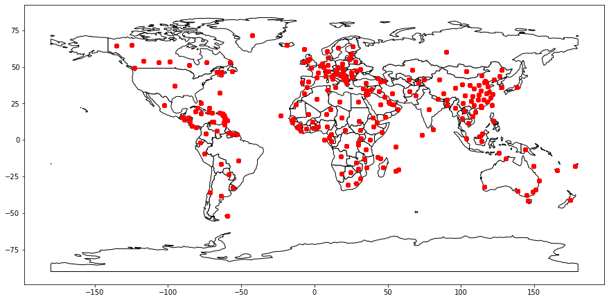

# Architecture for data science:  Excercises for week 1 and 2

In this workshop you will learn how to make use of LoRaWAN (a low power wide area network solution).
You will:
 * Register an account on The Things Network
 * Register a device by hand on The Things Network
 * Use a script for registering another 259 devices
 * Use the command line tool for simulating message
 * Create a decoder so that messages can be read

## 1. Register on The Things Network
The things network is a hub to which sensor messages can be directed. The sensors need to be configured so that they log their messages to your account. The Things Network can subsequently decode the hexadecimal encoded message into readable data and integrate it with other platforms such as data storage providers.
* Go to https://www.thethingsnetwork.org/ and click on Sign Up
* Create an account and go to the Console in the webapplication
* You will see two options:
  1. **Applications**  
  These are for receiving messages from your own devices and process messages with integrated platforms.
  2. **Gateways**  
  These are gateways that you own to connect devices to. Usually your devices will be able to find an open gateway and therefore you wont have to buy your own gateway. If the connectivity on your property is bad, you can consider to register your own gateway. 
  There is a gateway on the Avans building in s Hertogenbosch.
* Create an application.
  * The ID has to be globally unique.
  * The description you can choose for yourself.
* Go to your application, you will see:
  * Overview with your settings;
  * Application EUIS, you will need this when configuring a physical device;
  * Devices, we will add them later;
  * Access keys, we will use them later;
* On settings you can also add collaborators, so you can work together on a single project.

You have now successfully registered your first application on The Things Network and you are ready to add your devices. But first, we need to examine our data in order to understand our devices settings.

## 2. The data
We will use a data set to simulate sensor data. This data set can be found on https://www.kaggle.com/imdevskp/corona-virus-report?select=covid_19_clean_complete.csv and has records on the Corona virus per country. These records have the following data:
* Province/State, 
* Country/Region, 
* Lat, 
* Long, 
* Date, 
* Confirmed,
* Deaths, 
* Recovered, 
* Active, 
* WHO Region

We can simulate sensors using this data set. We consider every unique (Lat, Long) as a location of a sensor and we thus have sensors with a description of the Province/State and Country/Region.
The data it sends is the Date, Confirmed, Deaths, Recovered.

A sample of the data set is:

| Province/State   | Country/Region   |     Lat |   Long | Date       |   Confirmed |   Deaths |   Recovered |   Active | WHO Region            | Name        |
|:-----------------|:-----------------|--------:|-------:|:-----------|------------:|---------:|------------:|---------:|:----------------------|:------------|
|                  | Bahrain          | 26.0275 |  50.55 | 2020-05-05 |        3720 |        8 |        1762 |     1950 | Eastern Mediterranean | Bahrain     |
| Macau            | China            | 22.1667 | 113.55 | 2020-03-07 |          10 |        0 |          10 |        0 | Western Pacific       | China_Macau |
|                  | Russia           | 60      |  90    | 2020-01-26 |           0 |        0 |           0 |        0 | Europe                | Russia      |

### 2.1 Simulated sensors
As said before, we can register sensors based on their Province/State+Country/Region and provide their (Lat/Long). We will have 260 devices across the globe.

### 2.2 Register you first device
We are going to register the first device by hand. The device we are going to register is the one in the Netherlands.
To do this, take the following steps:
* Click on Register Device
* Use 'netherlands' as Device ID. Be sure to make no typing errors as we will use this ID later to send data.
* Click on the generate button for Device EUI. We are going to simulate this one, but if you had an actual device, you should put the number printed on the device in here.
* Click Register. 
  You see the Device overview now. This information is important for real devices to configure. We won't need this in our simulation. 
  Downlink means sending messages to the device, we won't be using that. 
  We can simulate the device in the bottom lower, that we will do using a script. 
* Try to find the setting for the location of this device. Use the values **52.1326, 5.2913**. 
* If you have set the device's location correctly, you should see on its overview that it is located near Soesterberg.