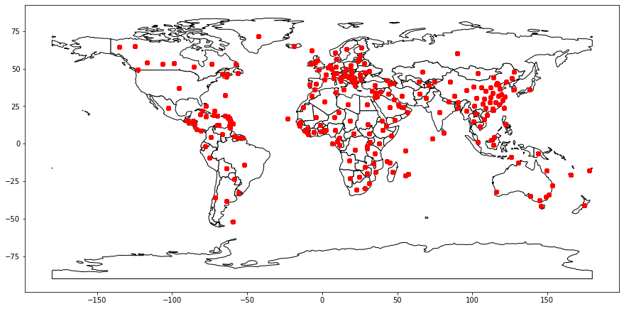
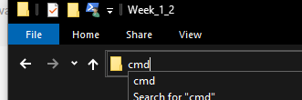
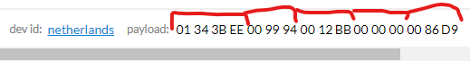

# 1. Excercises for week 1 and 2 <!-- omit in toc -->

In this workshop you will learn how to make use of LoRaWAN (a low power wide area network solution).
You will:
 * Register an account on The Things Network
 * Register a device by hand on The Things Network
 * Use a script for registering another 259 devices
 * Use the command line tool for simulating message
 * Create a decoder so that messages can be read

**Table of contents**
- [1. Register on The Things Network](#1-register-on-the-things-network)
- [2. The data](#2-the-data)
  - [2.1. Simulated sensors](#21-simulated-sensors)
  - [2.2. Register you first device](#22-register-you-first-device)
- [3. Register you client on The Things Network](#3-register-you-client-on-the-things-network)
- [4. View your message just sent](#4-view-your-message-just-sent)
- [5. Run the script to register devices for all countries](#5-run-the-script-to-register-devices-for-all-countries)
- [6. Run simulation of devices](#6-run-simulation-of-devices)

## 1. Register on The Things Network
The things network is a hub to which sensor messages can be directed. The sensors need to be configured so that they log their messages to your account. The Things Network can subsequently decode the hexadecimal encoded message into readable data and integrate it with other platforms such as data storage providers.
* Go to https://www.thethingsnetwork.org/ and click on Sign Up
* Create an account and go to the Console in the webapplication
* You will see two options:
  1. **Applications** <br/>
  These are for receiving messages from your own devices and process messages with integrated platforms.
  2. **Gateways** <br />
  These are gateways that you own to connect devices to. Usually your devices will be able to find an open gateway and therefore you wont have to buy your own gateway. If the connectivity on your property is bad, you can consider to register your own gateway.<br />
  There is a gateway on the Avans building in s Hertogenbosch.
* Create an application.
  * The ID has to be globally unique.
  * The description you can choose for yourself.
* Go to your application, you will see:
  * Overview with your settings;
  * Application EUIS, you will need this when configuring a physical device;
  * Devices, we will add them later;
  * Access keys, we will use them later;
* On settings you can also add collaborators, so you can work together on a single project.

You have now successfully registered your first application on The Things Network and you are ready to add your devices. But first, we need to examine our data in order to understand our devices settings.

## 2. The data
We will use a data set to simulate sensor data. This data set can be found on https://www.kaggle.com/imdevskp/corona-virus-report?select=covid_19_clean_complete.csv and has records on the Corona virus per country. These records have the following data:
* Province/State, 
* Country/Region, 
* Lat, 
* Long, 
* Date, 
* Confirmed,
* Deaths, 
* Recovered, 
* Active, 
* WHO Region

We can simulate sensors using this data set. We consider every unique (Lat, Long) as a location of a sensor and we thus have sensors with a description of the Province/State and Country/Region.
The data it sends is the Date, Confirmed, Deaths, Recovered.

A sample of the data set is:

| Province/State   | Country/Region   |     Lat |   Long | Date       |   Confirmed |   Deaths |   Recovered |   Active | WHO Region            | Name        |
|:-----------------|:-----------------|--------:|-------:|:-----------|------------:|---------:|------------:|---------:|:----------------------|:------------|
|                  | Bahrain          | 26.0275 |  50.55 | 2020-05-05 |        3720 |        8 |        1762 |     1950 | Eastern Mediterranean | Bahrain     |
| Macau            | China            | 22.1667 | 113.55 | 2020-03-07 |          10 |        0 |          10 |        0 | Western Pacific       | China_Macau |
|                  | Russia           | 60      |  90    | 2020-01-26 |           0 |        0 |           0 |        0 | Europe                | Russia      |

### 2.1. Simulated sensors
As said before, we can register sensors based on their Province/State+Country/Region and provide their (Lat/Long). We will have 260 devices across the globe.


### 2.2. Register you first device
We are going to register the first device by hand. The device we are going to register is the one in the Netherlands.
To do this, take the following steps:
* Click on Register Device
* Use 'netherlands' as Device ID. Be sure to make no typing errors as we will use this ID later to send data.
* Click on the generate button for Device EUI. We are going to simulate this one, but if you had an actual device, you should put the number printed on the device in here.
* Click Register.<br />
  You see the Device overview now. This information is important for real devices to configure. We won't need this in our simulation.<br />
  Downlink means sending messages to the device, we won't be using that.<br />
  We can simulate the device in the bottom lower, that we will do using a script.<br />
* Try to find the setting for the location of this device. Use the values **52.1326, 5.2913**. 
* If you have set the device's location correctly, you should see on its overview that it is located near Soesterberg.

## 3. Register you client on The Things Network
In order to communicate with The Things Network programmaticallly, we have to connect with it using the ttnctl.exe tool provided in this repository.
The description on this tool and how to use it can be found on https://www.thethingsnetwork.org/docs/network/cli/api.html

* Authenticate yourself using the tool. Run a command line tool by entering CMD in your address bar in the current folder and hit enter (on Windows)<br />
  
* Now follow the steps described in the Register and Login section on https://www.thethingsnetwork.org/docs/network/cli/quick-start.html
  * You can skip step 1 (you already have an account)
  * ***Important: You cannot CTRL+V in a command shell, use right click to do that.***
*  Now run *'ttnctl applications select'* to select your application.
*  You are now able to run a simulation. The following should succeed: <br />
```bash
ttnctl devices simulate netherlands 01343bee0099940012bb0000000086d9
```

## 4. View your message just sent
You have just sent your first message from a device that is located in the Netherlands (just play along with me ;) )! Now try and view your data on The Things Network.
* Try and find the data just sent on The Things Network.<br/>
**Note that this data is not persisted! The Things Network is just a hub to integrate with other solutions in your architecture, we will persist the data in next weeks workshop**<br />
There are two ways to do this:
  1. View all devices data
  2. View just the data of one device
* Unfortunately, this is the encoded message and we cannot read that. **Remember why it is encoded?** I have higlighted the parts that add up to the different fields, we just have to run a script to decode it again.

* Luckily, the Things Network can decode it for us if we provide a script. Most sellers provide their scripts with their devices and so have I. Try to find the place where you can enter your decoder and copy/paste the following into that box:
```javascript
function DecodeCovidPayload(data){
    var obj = {};
    var curIndex = 0;

    function hexToInt(length){
        var vals = data.slice(curIndex, curIndex + length);
        var strValue = '0x';
        for (i in vals) {
            strValue += ('00' + vals[i].toString(16)).slice(-2);
        }

        value = parseInt(strValue);

        curIndex = curIndex + length;
        return value;
    }

    function hexToGeo(length){
        positive = data[curIndex] > 0;

        var vals = data.slice(curIndex + 1, curIndex + length);
        var strValue = '0x';
        for (i in vals) {
            strValue += ('00' + vals[i].toString(16)).slice(-2);
        }
        value = parseInt(strValue) * 1.0 / 10000;

        if (!positive)
            value *= -1;

        curIndex = curIndex + length;
        return value;
    }

    var date = hexToInt(length=4).toString()
    obj.date = date.substring(0, 4)+'-'+date.substring(4, 6)+'-'+date.substring(6, 8);
    obj.confirmed = hexToInt(length=3);
    obj.deaths = hexToInt(length=3);
    obj.recovered = hexToInt(length=3);
    obj.active = hexToInt(length=3);
    obj.lat = hexToGeo(length=5);
    obj.long = hexToGeo(length=5);
    return obj;
}

function Decoder(bytes, port) {
  return DecodeCovidPayload(bytes);
}
```
* Run the command to send a message a second time and go to back to your data and see if it is decoded right and we can read the values.

## 5. Run the script to register devices for all countries
To do this, the following is required:
* Python 3.x with the following modules:
  * Pandas
* The file *covid_19_clean_complete.csv* in the same folder
* The file TTNCTL.exe in the same folder

The script can be ran by executing the command:
```bash
python register_devices.py
```
This may take a while to complete

After completing you should see all of your devices registered in The Things Network.

## 6. Run simulation of devices
You can now run the simulation of devices and check if all of the messages are received by The Things Network. Keep the data tab in The Things Network open. Then execute the following command:
```bash
python simulate_devices
```

If you want to send data from a certain data on forward use the following command:
```bash
python simulate_devices <<date>>
```
<\<date\>> can be replaced by a number formatted date like 20200430 (yyyymmdd)

Again, note that The Things Network does not store your data and that it will be lost. Next week(s) we are going to integrate with a storage provider to persist the data.