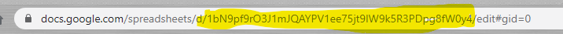
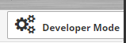
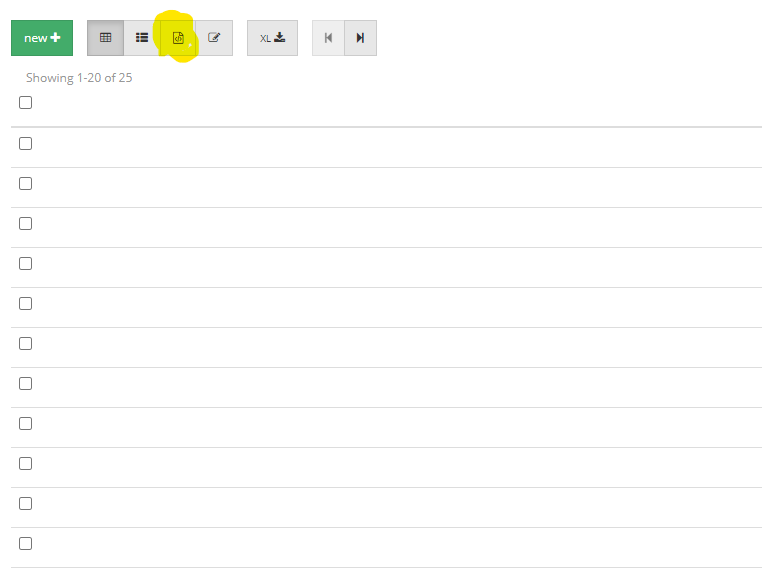
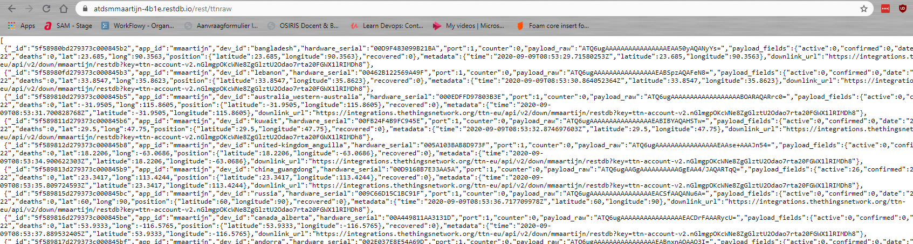

# 2. Excercises for week 3 and 4 <!-- omit in toc -->

In this workshop you will learn how to channel your device messages from a message Hub (The Things Network) to a structured and to an unstructured data storage provider.

You will:
 * Create a google sheet to store the structured messages
 * Enrich the document to actually threat the messages as structured
 * Create a RestIO semi-structured database
 * Store the messages in RestIO semi-structured database

**Table of contents**
- [1. Structured Data](#1-structured-data)
  - [1.1. Create a Google Sheet to receive the data.](#11-create-a-google-sheet-to-receive-the-data)
  - [1.2. Create an integration in The Things Network](#12-create-an-integration-in-the-things-network)
  - [1.3. Verify that your integration works](#13-verify-that-your-integration-works)
  - [1.4. Make the data more structured](#14-make-the-data-more-structured)
- [2. Semi-structured data](#2-semi-structured-data)
  - [2.1. Create a NO-SQL database](#21-create-a-no-sql-database)
  - [2.2. Enable access on your database](#22-enable-access-on-your-database)
  - [2.3. Add an integration for your database.](#23-add-an-integration-for-your-database)
  - [2.4. Verify that your integration works](#24-verify-that-your-integration-works)
  - [2.5. View and filter your data in your browser itself.](#25-view-and-filter-your-data-in-your-browser-itself)

# 1. Structured Data
## 1.1. Create a Google Sheet to receive the data.
* Go to your Google Drive folder (https://drive.google.com).
* Create a new Google Sheet, choose a name for the sheet that suits you.

We are going to let The Things Network forward the decoded sensor data to this Google sheet. We have to have an endpoint that is able to receive these message. Therefore, we need to add a script to our sheet and deploy it as an endpoint in the cloud.

* Within the Google Sheet go to Tools and then Script Editor.<br />
  A new window opens in which you can add JavaScript.
* Paste the following text in this window:
```javascript
function doPost(e) {
  var sheet = SpreadsheetApp.openById("<<Your ID here>>");
  var firstSheet = sheet.getSheets()[0];
  firstSheet.setName("TheThingsNetwork data");
  
  var jsonData = JSON.parse(e.postData.contents);
  columns = ['app_id', 'dev_id', 'hardware_serial', 'port', 'counter', 'payload_raw', 'metadata', 'payload_fields']
  
  values = []
  values.push(jsonData.app_id);
  values.push(jsonData.dev_id);
  values.push(jsonData.hardware_serial);
  values.push(jsonData.port);  
  values.push(jsonData.counter);
  values.push(jsonData.payload_raw);
  values.push(JSON.stringify(jsonData.metadata));
  values.push(JSON.stringify(jsonData.payload_fields));  
  
  firstSheet.getRange(1,1,1,columns.length).setValues([columns]);
  firstSheet.appendRow(values);
  return ContentService.createTextOutput(JSON.stringify(e))
}
```

* You can see now that you need to fill your Sheet-ID where it says <\<Your ID here\>>. This ID can be found in the URL of your Google Sheet as shown in the picture below. In my example it is 1bN9pf9rO3J1mJQAYPV1ee75jt9IW9k5R3PDpg8fW0y4.

* Now review your script, what does it do?<br />
  * It is a function that will fire on a post of new data.
  * In the function, first, we get our sheet and name it "TheThingsNetwork data".
  * Then we define our columns (these are according to the values we will receive).
  * Next, we define an array of values and store our JSON properties we receive from The Things Network.
  * See that we do not unpack the metadata and the payload fields. We simply store them as text.
  * Lastly, we store the column names in the first row and append the newly gotten data after the last row.

We now have to publish this endpoint so that we can connect The Things Network to this sheet.
* Click on Publish and choose "Deploy as web app..."
* Choose a(n) (arbitrary) project name.
* Now you get a dialog where you have to set the following:
  * Project version: New (when applying changes later, always set to new!)
  * Execute the app as: Me
  * Who can access the app: Anyone, even anonymous
* Click on deploy, it'll ask for permissions and you should grant those permissions.
* You could possibly get the following message:

  * In this case, click on advanced and choose "Go to <\<your project name\>> (unsafe)<br />
    *Trust me, it is safe, we all now what we have done in this script.*
  * Then click allow and OK on the next screen.
  * Your endpoint is deployed now.

## 1.2. Create an integration in The Things Network
The Things Network functions as a data hub, many sensors can gather and send data to this hub and their messages are decoded. As you have seen in the previous assignment, The Things Network doesn't store the data itself. Therefore, we need an integration with a storage provider. In the previous section we have configured a storage provider (a simple Google Sheet in our case), now we just have to send our data to this provider.

* Go to The Things Network and open the console (on the website).
* Open your project and try to find the place where you can add an integration.
* We have configured our Google endpoint to be an http-endpoint, so now choose for an http-integration. We have to configure the following:
  * Process ID: Choose a name that suits you.
  * Access key: default
  * URL: We have to get the URL from our Google endpoint so that the connection can be made.
    * Open your Google Sheet again, go to the script and click on deploy again. Do not actual deploy, but copy the link it will be deployed to.
    * Use this link in the URL for the http-integration.
  * The other values can be left black / default.

## 1.3. Verify that your integration works
We now have (successfully) made an integration from The Things Network to our Google Sheet. We can now test this integration by rerunning our simulation.
* Open a cmd window in the folder of the assignment of last week
* Rerun the following command:
```bash
python simulate_devices.py
``` 
*Remember that you could also filter the dates and countries that are simulated if you want to!*
* Open your Google Sheet and see that data is received.<br />
  *If you leave your simulation running and keep the sheet open, you will see that data keeps coming in.*
* You can stop the simulation script now.

## 1.4. Make the data more structured
As you can see in the Google Sheet, our data is not yet really structured. We want the column "payload_fields" to be splitted into functional columns with one value each. Only then, we can count and aggregate our data and only then we can do (automated) analysis on these data. To achieve this, we have to modify our Google Script so that these values are extracted into their own columns.

* Open the Script Editor of your Google Sheet again to see your script.
* Now, we will add some scripting to extract the values from the payload_fields. To do so, locate the last line where values are pushed in the array and add the following script below that:
```javascript
for (var key in jsonData.payload_fields){
    columns.push(key);
    values.push(jsonData.payload_fields[key]);
  }
```
* Now publish this script again, make sure to set the "Project version" to "New".
* Next, re-execute the simulation script. You can see the new records coming in with more columns added to the right. These records have the values extracted from the payload_fields.

**Note 1:**
You can see that the old records don't have those fields extracted. In data science projects, this happens a lot. We often have incomplete or incorrect data due to insights in our data or changes in the source systems. Of course, we can extract those fields now or we can leave them be. That depends on how important those individual datapoints are and how many of them there are. If we want to see trends from now on into the future, we can ignore them, if we actually need those data to say something on what happened in that period of time, we actually have to extract those values.

**Note 2:**
We now have only got one type of sensor (the COVID-19 sensor). If we would have gotten multiple sensors, we should consider giving each of these sensors their own columns (which leads to a lot of empty values) or giving each of these sensor types their own document(s) or sheet(s) in this document. If we do that, we have to do more data preparation in the data visualisation or machine learning part by joining those data sets.

# 2. Semi-structured data

In this section we are going to make use of a NO-SQL database. NO-SQL stands for Not Only Structured Query Language and works perfect for those JSON documents we get from our (simulated) devices.
Advantages are that we do not have to provide metadata (column information) on beforehand and that our documents can be structured differently compared to other documents. In other words, we can easily store data from different types (or versions) of devices in one collection and query them later.

There are multiple NO-SQL database providers available, we use a free provider named RestDB. This provider allows us to view our data in the browser and query them with URL parameters.
For larger projects, you could take a look into MongoDB or Cassandra DB (both available on Azure).

## 2.1. Create a NO-SQL database
* Go to https://RestDB.io and sign up for a new account
* Create a new database by clicking on create new.
  * Give it a name that suits you.
* Go to the database just created and create a collection.
  * You can give it a name, description and icon. I named mine 'ttnraw' and left description and icon blank.
* If you look at the left side of your window, you can see your new collection, you can expand it and open settings.
  * Within these settings you can see that you can define fields. That is **not** wat we want to do, as we don't want to have structured data and we do not want to define our data on beforehand. *But you can use this afterwards for example if you detect certain structure in your collection of documents.*

*Note, if you cannot find 'settings', you probably haven't enabled developer mode. On the top right of your screen you can enable it, the button will be orange if enabled.*




*Developer mode is off versus developer mode is on* 


## 2.2. Enable access on your database
Now that we have created a database and a collection, we want to be able to send data to that collection from another application (The Things Network). To be able to do so, we have to set the access policies.

* Go to the settings of your database (in the menu on the left, below the last horizontal line)
* Go to the tab API (Application Programming Interface), we want to give applications access.
* Add new Web page API key (CORS), give it a suitable name and check GET, POST, PUT, DELETE, PATCH.
* Now copy your newly generated key, we will use that in our integration in The Things Network.

## 2.3. Add an integration for your database.
* As we did with our Google Sheets http integration, create a new http-integration with the following values:
  * Access key: Default key
  * URL: Find the URL of your collection in the settings of your collection in Restdb.io
  * Method: POST
  * Authorization: leave blank
  * Custom header name: x-apikey
  * Custom header value: <\<paste your copied API-key here.\>>

## 2.4. Verify that your integration works
Now that we have two integrations, we can check both of them.
Check them by re-running the simulation script and validate that your Google Sheet (still) gets new data **and** that data arrives in RestDB.io.

In RestDB you will probably see an (seemingly) empty list being created like in the image below.


Hit the button highlighted in yellow (in the picture), you will then see the JSON data as was sent by The Things Network.

## 2.5. View and filter your data in your browser itself.
You can now browse your data in the browser itself without even going to the RestDB application. You can do that by entering the URL of your collection in the address bar of your browser. You will see something like this:


*If you want to have a prettier view of your data and if you use the Chrome browser, you can install an extension called JSONView, it will reformat the text so that your data is more readable. Visit https://chrome.google.com/webstore/detail/jsonview/chklaanhfefbnpoihckbnefhakgolnmc?hl=en to install the extension.*

* Now, you can add a query to the URL to filter or aggregate your data.
  * Try to filter on records that 1 or more active cases of COVID-19 by adding the following to the URL:
  ```
  ?q={"payload_fields":{"active":{"$gt":0}}}
  ```
  You can see that we do not have a structure defined on beforehand. Instead, we query on our data ad hoc by telling that we expect (some of) our documents to have a property 'payload_fields' that has a property 'active'. We query on '$gt' which is the operator for 'greater than' and compare it to the value of 0.

  To see which operators are possible, take a look at the documentation on https://restdb.io/docs/querying-with-the-api#restdb
  * Try to aggregate the data by taking the base URL again (before the question mark) and adding the following:
  ```
  ?h={"$aggregate":["SUM:payload_fields.active","COUNT:payload_fields.active"]}
  ```
  To see which operators are possible for aggregation, take a look at the documentation on https://restdb.io/docs/nosql-database-aggregation#restdb
  
Finally, you might have seen that the first query (the filtering) starts with a 'q' and the second one starts with an 'h'. These letters are different so that they can be combined.
  * Try to combine the query on filtering on active > 0 and then counting and sum up the number of active results in that subset by executing the combined query:
  ```
  ?q={"payload_fields":{"active":{"$gt":0}}}&h={"$aggregate":["SUM:payload_fields.active","COUNT:payload_fields.active"]}
  ```
  As you can see, you can combine those queries by adding an ampersand (&) in between. To see different results, try changing it so that we take active > 2.