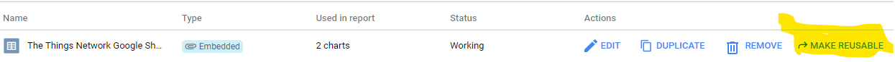
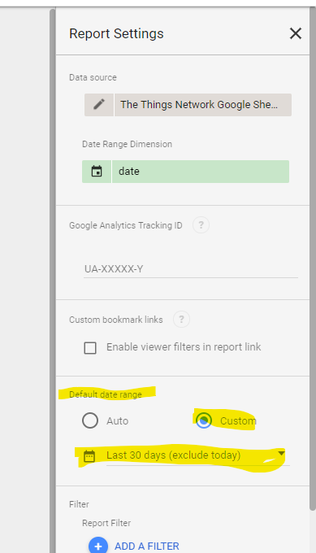
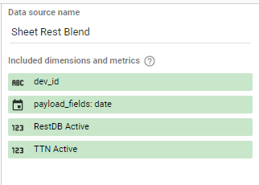
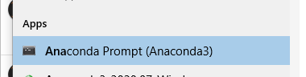
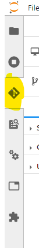
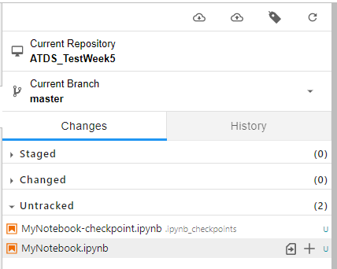

# Excercises for week 5 and 6 <!-- omit in toc -->

In this workshop you will learn how to retrieve your data and show it in a visualization environment and you will get your data in a python notebook in Google Colaboratory.
You will both use your Google Sheet and your No SQL database from the previous assignment.

You will:
 * Create Google Data Studio Dashboard using your Google Sheet
 * Link your NO SQL database to your Google Data Studio Dashboard
 * Create a Google Colaboratory python script
 * Link your data from both your Google Sheet and your NO SQL database to your python script.

**Table of contents**
- [1. Visualization: Google Data Studio](#1-visualization-google-data-studio)
  - [1.1. Data sources](#11-data-sources)
  - [1.2. Adding a chart](#12-adding-a-chart)
  - [1.3. Filtering](#13-filtering)
    - [1.3.1. Report settings](#131-report-settings)
  - [1.4. Sharing and notifications](#14-sharing-and-notifications)
  - [1.5. Using your RestDB NO-SQL data](#15-using-your-restdb-no-sql-data)
  - [1.6. Using your RestDB data](#16-using-your-restdb-data)
- [2. (Continual) Code development, with Machine learning in mind.](#2-continual-code-development-with-machine-learning-in-mind)
  - [2.1. Collaboration: Git](#21-collaboration-git)
  - [2.2. Standardization: Embed in JupyterLab](#22-standardization-embed-in-jupyterlab)
    - [2.2.1. Sending (pushing) your changes to the cloud.](#221-sending-pushing-your-changes-to-the-cloud)
  - [2.3. Scalability](#23-scalability)
  - [2.4. Reproducibility](#24-reproducibility)

# 1. Visualization: Google Data Studio

We are going to create a dashboard using Google Data Studio. Google offers this service for free and it is a rich environment in which we can create dashboards using cloud services (Software as a Service). Google Data Studio integrates with all other Google products and various integrations for other providers are offered so that you can connect to your data.

We are going to create a simple report using our COVID-19 data.

* Start by navigating to https://datastudio.google.com/
* Create a new report by clicking on Blank Report.
* You will be prompted to add data to you report and we will do that by choosing Google Sheets.
  * Find your Google sheet containing your Things Network data.
  * Let the defaults, your sheet has headers in the first row and hidden and filtered cells can be included as we don't have them.
* As with all Google products, change the title of your document in the top left of the screen so that you will be able to find it again.
* You will see that a table has been added to a sheet of 'paper'. This is your report.
* On the right, you can configure your table. Start by selecting 'Active', 'Confirmed', 'Recovered' and 'Deaths' as metrics. You see that they are added as SUM, but our data is repeated over each row, so we need to select MAX in order to now how much people are affected. Change this by clicking on them and selecting MAX.
* Of course, the app_id is not the dimension we are interested in. Lets remove that and select 'dev_id' as the dimension.
* Click the blue View button in the top right and see that you have created your first dashboard item with a table on which you can sort the columns.

## 1.1. Data sources

In the following image you can see the data parts that you have in a Dashboard. The data set is the Google Sheet you have got, the connector you specified by selecting the Google Sheet connection to your sheet. The report we created and now we are going to enrich the Data Source by having better region names.


* In the top menu, go to Resource -> Manage Added Data Sources.
* Click on edit on your data source.
* Again, in the top left rename your data source to 'The Things Network Google Sheet Source' for example.
* You can see that all fields can be metrics or dimensions with their default behaviour.
  * Remove (hide) the fields that aren't important such as payload_fields
  * Set the aggregation to the right values
  * Add descriptions if desired.
* Now we want a position field, so we add them by clicking on the Add A Field button
  * Name the field Geolocation
  * Set the following as the formula:
  ```
  CONCAT(lat, ",", long)
  ```
  * Go back and set the type of this field to Geo -> Latitude, Longitude. We will use it later.
* We also want two fields: Country and Region. These should be derived from dev_id. Can you do that? Tip: For country we can use the regex (for regions: replace the 0 with a 1). The regex splits a string based on underscores, use the following Data Studio function: REGEXP_EXTRACT, pass the correct field and pass the following regular expression.
  ```
  '^(?:[^\\_]*\\_){0}([^\\_]*)'
  ```

You can imagine that, with self service dashboarding, you need to do a lot of work here. Prepare your data source to be as helpfull as possible so that no incorrect conclusions will be made. At this point we created an embedded resource, but you can choose to make it reusable so that it is no longer embedded in this dashboard. Users will be able to choose your data source when creating new dashboards so that they no longer have to map their data set themselves anymore.
You typically would want to offer a set of data sources which you have preprocessed so that users can select from these and be self sufficient.


## 1.2. Adding a chart
We have created a Geo field and called it Location. Lets use that in our dashboard by adding a Bubble Map.
* Click on add a chart and choose for bubble map.
* See that your data source is selected automatically and that your dimension is set to your geolocation.
* You should see bubbles on the map corresponding to your device locations.
* If you select 'active' as a metric, your bubbles will be of size corresponding to the number of active COVID-19 cases.
* Click view now, your report will be shown as you created it, and note that it does that quickly. Most dashboarding tools use caching to be efficient.
In the following picture you can see how those caches work. There is a query cache on each chart, therefore filters are applied on the data source and then charts are rendered and cached.


## 1.3. Filtering
There are two types of filtering that could be interesting. Filter controls and filters in charts/tables that affect other charts and tables. Lets go and see what we would like to do.
* First, add a third chart, a vertical bar chart for example. As dimension we can use 'Country' as a metric choose 'active'.
* Enable drill down and select 'Region'.
* View the report. If you select China and right click you can select drill down to see all of the regions.
* Now we want to have a filter. Add a control, for example a drop down list that uses Country as a filter.
* When you view your report again, you see that all of the report elements interact with this filter.

A second option is filtering within the charts/tables themselves. We can do that, by taking the following steps:
* Select your vertical bar chart.
* In the data tab, scroll all the way to the bottom and check Interactions -> Apply filter.
* The chart now functions as a filter. Click on view again and see what happens if you select an item.

Typically you want those items to interact with each other, but for all of the items this has to be enabled so be aware to do that if you'd prefer this option.

### 1.3.1. Report settings
Be aware that your report can have settings that overrule certain settings in your charts. If you go to file -> Report settings, you can see that your primary data source can be set and a date range dimension can be selected. If the date range dimension is set, you see that the Default Date Range can be set to Auto and Custom. If you don't see any data, it could be due to this setting. Our data is mostly located in the first months of 2020, and if the date range is set to the last 30 days for example, no data is to be shown.

On the other hand, this date range can be of use when having big data and only the last X days of data need to be shown. This increases performance and uses less data.



## 1.4. Sharing and notifications
A report isn't of use much if the right people cannot access it. Therefore, these reports (as all of Google's products) can be shared with the share button. You can also choose to embed the report in other pages for example.

Lastly, the report can be emailed daily. Other products often have notification or error warnings that can be set on KPI's, that would result in the best insights of course. Be aware of the sharing and notification settings for these kind of products.

## 1.5. Using your RestDB NO-SQL data
Your (big) data is often not stored in a Google Sheet. Luckily, other sources can be bound to dashboards. For Google Data Studio, you can choose (virtually) any Google product, including BigQuery. This means that you can embed data sources up to petabytes of scale into this product.
Additionally, third parties have built connectors so that you can embed other sources into a dashboard.

* Go to Resource -> Manage added data sources.
* Add a data source
  * Search for 'json' and select 'Custom JSON/CSV/XML'.
  Our NO-SQL database is filled with JSON documents so this connector is the one we need.
* You will be prompted to fill in your personalia, you can skip that by scrolling down and selecting next.
* Now fill in the form:
  * Data Type: JSON
  * Source URL: Your URL from your RestDB collection, mine is https://atdsmmaartijn-4b1e.restdb.io/rest/ttnraw for example.
  * As you can see, you don't have access to mine, neither has Google to yours without your API-key. Add it in the HTTP-headers field like so:
  ```javascript
  { "x-apikey": "<<your api-key here>>" }
  ```
  * Check both 'Convert numeric-looking values to numbers' and 'Convert date-looking values to dates'
  * Click Add in the right bottom
  * Now edit your connection, you will see that all of your fields are collected.
  * Again: You can change your connection name in the top. Name it something like 'JSON RestDB Source'.

## 1.6. Using your RestDB data
* Create a new page
* Add a table to the page and set the source to your new RestDB source.
* Now you see your empty table...

Remember the report settings that we mentioned earlier? This empty data has got to to with the default filter in the report.

* Go to report settings and set the default date range to 'This Year'. Now you will be able to see the data.
  *I don't know why it adds this filter, but with this range you will be able to see your data.*

Now we will combine our sources. Usually we combine sources such as weather data and moist data for example, but now we are going to combine our sources on exactly the same key, just to see if it works.

* Go to Resource -> Manage blended data
* Add a data view
* Select your JSON source and Google Sheet source.
* On join keys, in both, select dev_id and date (payload_fields: date in JSON).
* On metrics select active and payload_fields: active
  * Make sure both are selected to have MAX calculation.
  * Give both of them a different name so you can select them both in your report.
  * Give the blended data source a good name.<br />

* Now close your data manager and go back to your dashboard.
* Add a table, set its data source to your new blend.
* Use dev_id as your dimension
* Use both the active fields as a metric.

Now you can see that you succesfully have used both data sources. Your data in both sources is exactly the same, but you can imagine that you have other blends in other projects.

We have shown that we can use several types of data sources in our dashboards, that we can use it in our cloud environment and that we even can blend those data to become even more powerfull.

Next, we are going to use our data in a machine learning environment.

# 2. (Continual) Code development, with Machine learning in mind.
In this section we are going to practice with some of the concepts of continual machine learning.

We are going to make steps in:
* Collaboration
* Standardization
* Reproducibility

## 2.1. Collaboration: Git
We are going to use Github for collaboration. This allows us to share our code with team members and be sure to work with them on the same version(s).

Follow the following steps:
* Install GIT: https://git-scm.com/downloads
* Create account on Github: https://github.com/
This is where your code will be stored.
* Once you have an account, create a new repository for your code by hitting the green 'new' button.
  * Give it a name that suits you.
  * Make it a private repository by hitting the button.

You have now created a repository for your code, now we want to be able to collaborate.
* Go to 'Settings' and then to 'Manage Access'

You can see that your repositor is private. This means that no one else but you can access this repository. Now we want to add a collaborator.
* Click on 'invite a collaborator'.
* Ask a fellow student his or her username on github and add him/her to your repository. You can both now collaborate using the same code.

## 2.2. Standardization: Embed in JupyterLab
You have already made use of JupyterLab in the Python workshops. Of course we want to standardize this method of working with one tool only. Therefore, we are going to integrate your Github settings into JupyterLab so that you can collaborate with your teammates.

* Open Jupyter Lab
* Go to Settings and check 'Enable Extension Manager'.

On the left of your screen you have now got an image of a puzzle piece, this is the extension manager.

* Open the extension manager and search for GIT. The top selection should be *@jupyterlab/git*. Install this extension.
* Now open Anaconda Prompt (from Anaconda itself or from the Windows Menu, see image)<br/>

* Rebuild Jupyter Lab by executing the following command:
  ```bash
  jupyter lab build
  ``` 

When refreshing JupyterLab you should see the Git plugin:


Now that we have a git-repository and the plugin in Jupyter Lab, we can open it in this new environment.
* Open the git tab in Jupyter Lab

Now you see three options: 
1. *Open the file browser:* This lets you choose a directory which is a 'clone' of a Git repository and work from there.
2. *Intialize a Repository*: This lets you create a new repository (like we just did on Github).
3. *Clone a repository*: This lets you clone a repository from somewhere.

*To clone a repository means that a folder structure (git repository) is copied to your local machine. So everyone in your collaborating team has got a 'clone' (copy). The version on Git (in this case Github) is the master, the one that contains the truth, the actual version we work with. We are going to send our updates to Github later in this section to be sure the truth-version is updated with our version.*

* Choose 'Clone a repository' and use the URL of your Github repository.
* It prompts for your username and password as your repository was marked private (these will be stored so that later on you don't have to enter them again later on.)
* Open the newly created, empty, folder (remember we have got a copy?).
* Create a notebook with a name that suits you.
* For now: add one line and execute this line:
  ```python
  print('test')
  ```

We have now got a local copy of the repository on Github. But remember, it is a copy and it is not synchronised by default. We have to stage our files, commit them and then push our changes to the server so that the truth version on Github has got these changes too.

* Open the Git tab again.
* You should see something like this (my mouse is hovering over MyNotebook.ipynb):

* Click on the **+**-sign to stage this file so that it can be sent to Github.
* Now in the bottom add a description of your changes such as:
  *Created new notebook with testprint.*
* Click commit.

Now that you have committed your changes you have marked them as your set of changes that need to be sent to Github. Remember: These changes are not sent yet! This is all just on your own laptop.

### 2.2.1. Sending (pushing) your changes to the cloud.
Now that we have staged (and commited) our changes, we are ready to send them to Github.

Do you see the two cloud icons in the top of the Github tab in Jupyter Lab? We need to use them to **pull** or **push** our changes from or to the server.

* Click on the cloud icon with the arrow pointing upwards. This lets you push your changes to Github. You should see a dialog that confirms your push and (hopefully) it mentions that it did this successfully.
* Open your Github repository in your browser. If everything went correct, you should see that the truth has changed, it now contains your new files.

Now all of your collaborators can pull your new truth.
The next steps only work if your collaborator has pushed changes:

* On the Github tab you can now click on the pull icon. (This is the cloud icon with the arrow pointing downwards).

The Git plugin now downloads all the files of the truth (Github in this case). In case of conflicts with your local files it tries to 'merge' them. If this cannot be done automatically, you will be prompted to merge your files by hand.

## 2.3. Scalability

You are familiar with JupyterLab on your notebook. Unfortunately, your notebook is just one computer with limited resources. if you want to do heavy calculations, your notebook will probably not suffice. A free alternative is Google Colaboratory. This environment lets you run your notebooks on fast computers with the options of using GPU (Graphical Processing Units) or TPU (Tensor Processing Units).
This means that heavy calculations can be done on hardware that is designed to do these calculations faster than when calculating in memory.

* Download the following Jupyter Notebook:  [ADTS_OpenGoogleSheet.ipynb](./ATDS_OpenGoogleSheet.ipynb)
* Go to https://colab.research.google.com/
* Choose:
  * Add the sheet to your drive and open it from there;
  * Or upload the sheet;
  * Or connect to your github repository to download the notebook (Colab does not support uploading to Github again though).
* Follow the instructions in the notebook.

## 2.4. Reproducibility

We are going back to our JupyterLab environment now to see what we can do on reproducibility.

* Download the following Jupyter Notebook: [ATDS_Reproducibility.ipynb](./ADTS_Reproducibility.ipynb)
* Open it in JupyterLab.
* Follow its instructions.